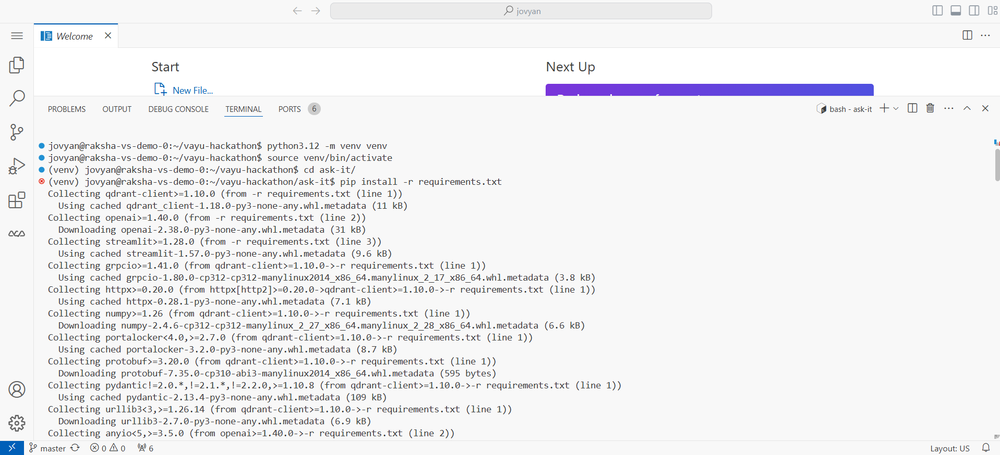
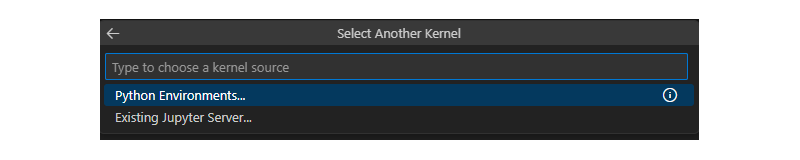
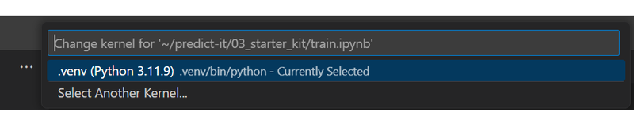

# Step 3 — Starter Kit (Training)

**Predict-It** › **Starter Kit** · `03_starter_kit/`

| | |
|--------|---------------|
| **⬅ Previous** | [Step 2 — Vayu MLflow](../02_vayu_mlflow/) |
| **Next ➡** | [Step 4 — Model Registry](../04_model_registry/) |

This step trains a **TF‑IDF + Random Forest** pipeline with **GridSearchCV**, logs optional metrics to **Vayu MLflow**, and exports `model.joblib` for deployment.

---

## Folder Contents

| File | Description |
|------|-------------|
| `train.ipynb` | Grid search, holdout metrics, save `model.joblib` and `category_labels.json` |
| `validation_predictions.csv` | Example batch predictions (generated after training) |

---

## Prerequisites

| Step | Vayu service / folder | Requirements |
|------|------------------------|--------------|
| 0 | `00_vayu_workspaces/` | Active Python environment |
| 1 | `01_dataset/` | `news.csv` and `validation.csv` available locally |
| 2 | `02_vayu_mlflow/` | MLflow deployment **Ready** (optional) |

Install dependencies:



```bash
cd predict-it
python3 -m venv .venv
source .venv/bin/activate
pip install -r requirements.txt
```

---

## Quick Start

1. **Open the training notebook:** `03_starter_kit/train.ipynb` in your Vayu AI Studio workspace, then select the kernel:

   1. Open **Select Kernel** and choose **Python Environments**.

      

   2. Under **Select a Python Environment**, pick the **Recommended** environment (it should point to the `.venv` from [Step 0](../00_vayu_workspaces/)).

      

   3. **Validate the path:** Confirm the selected interpreter path ends with `<your-env-name>/bin/python` (for example, `.venv/bin/python` if you created `.venv` in [Step 0](../00_vayu_workspaces/)).

2. **Configure MLflow in `.env`:** Set `MLFLOW_TRACKING_URI`, `MLFLOW_TRACKING_USERNAME`, and `MLFLOW_TRACKING_PASSWORD` in the root `.env` — the notebook loads them automatically via `load_dotenv` (see [overview](../README.md#minimal-run)).

3. **Run all cells:** The notebook trains the model, optionally logs to MLflow, and saves:

   | File | Purpose |
   |------|---------|
   | `model.joblib` | Deploy in [Step 4](../04_model_registry/) |
   | `category_labels.json` | Integer code → category name map |
   | `validation_predictions.csv` | Batch categories for unlabeled articles |

4. **Continue to registration:** Proceed to [Step 4 — Model Registry](../04_model_registry/).

---

## What the notebook does

| Stage | Output |
|-------|--------|
| Load data | `../01_dataset/news.csv`, `../01_dataset/validation.csv` |
| Label encoding | Five categories → integer codes |
| Grid search | 24 TF‑IDF + Random Forest combos (3-fold CV) |
| Holdout report | 20% stratified split from `news.csv` |
| Retrain best | Full `news.csv` |
| Infer | `validation_predictions.csv` |
| Export | `model.joblib`, `category_labels.json` |

---

## Pro tips

- Shrink `param_grid` or use `cv=2` for faster dry runs.
- Uncomment MLflow cells after [Step 2](../02_vayu_mlflow/) is ready.

---

## Navigation

| | |
|--------|---------------|
| **⬅ Previous** | [Step 2 — Vayu MLflow](../02_vayu_mlflow/) |
| **Next ➡** | [Step 4 — Model Registry](../04_model_registry/) |
| **🏠 Overview**| [Predict-It overview](../README.md) |
